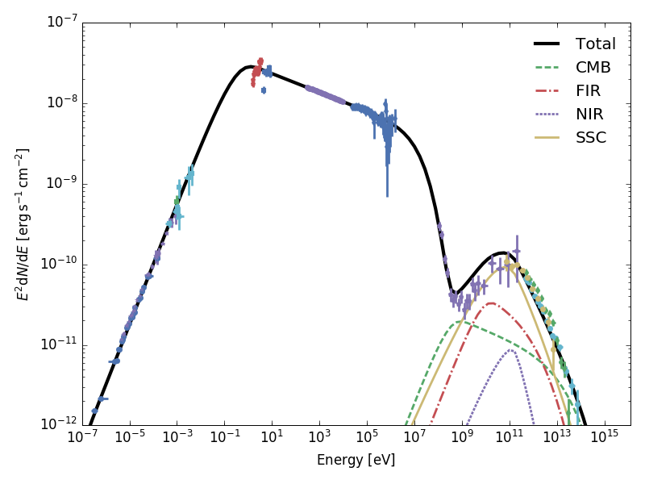

.. _radiative:

Radiative Models
================

Naima contains several radiative models that can be used to compute the
non-thermal emission from populations of relativistic electrons or protons.
Below there is a brief explanation of each model, and full details on the
physics and motivation for the implementation can be found in the referenced
articles.

All the radiative models take a particle distribution function as a first
argument. Several particle distribution functions can be found in the
`naima.models` module: `~naima.models.PowerLaw`,
`~naima.models.ExponentialCutoffPowerLaw`, `~naima.models.LogParabola`,
`~naima.models.BrokenPowerLaw`, and
`~naima.models.ExponentialCutoffBrokenPowerLaw`. To use them as a particle
distribution function the units of their amplitude must be in particles per unit
energy (i.e., convertible to ``1/eV``).  If you have computed a particle
distribution from a physical code and wish to compute its radiative output, you
can use the `~naima.models.TableModel` class to define a distribution function
from an array of energies and an array of particle numbers per unit energy. 

Here is an example of how you can use the Exponential Cutoff Power Law model as
particle distribution function for an inverse Compton model (see below in `IC`_
for details about the inverse Compton model).::

    >>> ECPL = naima.models.ExponentialCutoffPowerLaw(1e36*u.Unit('1/eV'), 1*u.TeV, 2.1, 13*u.TeV)
    >>> IC = naima.models.InverseCompton(ECPL, seed_photon_fields=['CMB'])

The parameters of the particle distribution can be accessed through the
``particle_distribution`` attribute of the radiative model, e.g.::

    >>> IC.particle_distribution.index = 1.8
    >>> print(ECPL.index)
    1.8

In addition, the same particle distribution instance can be used for several
radiative models simultaneously, for example when computing the synchrotron and
IC emission from an electron population::

    >>> SYN = naima.models.Synchrotron(ECPL, B=100*u.uG)
    >>> SYN.particle_distribution is IC.particle_distribution
    True

Once instantiated, the emission spectra from radiative models can be obtained
through the ``flux`` (differential flux) and ``sed`` (spectral energy
distribution) methods::

    >>> spectrum_energy = np.logspace(-1,14,1000)*u.eV
    >>> sed_IC = IC.sed(spectrum_energy, distance=1.5*u.kpc)
    >>> sed_SYN = SYN.sed(spectrum_energy, distance=1.5*u.kpc)

These spectra can then be analysed or plotted:

.. plot::

    import naima
    import astropy.units as u

    # Define models
    ECPL = naima.models.ExponentialCutoffPowerLaw(1e36*u.Unit('1/eV'),
            1*u.TeV, 2.1, 13*u.TeV)

    IC = naima.models.InverseCompton(ECPL, seed_photon_fields=['CMB', 'FIR', 'NIR'])
    IC.particle_distribution.index = 1.8
    SYN = naima.models.Synchrotron(ECPL, B=100*u.uG)

    # Compute SEDs
    spectrum_energy = np.logspace(-1,14,1000)*u.eV
    sed_IC = IC.sed(spectrum_energy, distance=1.5*u.kpc)
    sed_SYN = SYN.sed(spectrum_energy, distance=1.5*u.kpc)

    # Plot
    plt.figure(figsize=(8,5))
    plt.rc('font', family='sans')
    plt.rc('mathtext', fontset='custom')
    for seed, ls in zip(['CMB', 'FIR', 'NIR'], ['-','--',':']):
        sed = IC.sed(spectrum_energy, seed=seed, distance=1.5*u.kpc)
        plt.loglog(spectrum_energy,sed,lw=1,
                ls=ls,label='IC ({0})'.format(seed),c='0.25')
    plt.loglog(spectrum_energy,sed_IC,lw=2,
            label='IC (total)',c=naima.plot.color_cycle[0])
    plt.loglog(spectrum_energy,sed_SYN,lw=2,label='Sync',c=naima.plot.color_cycle[1])
    plt.xlabel('Photon energy [{0}]'.format(
            spectrum_energy.unit.to_string('latex_inline')))
    plt.ylabel('$E^2 dN/dE$ [{0}]'.format(
            sed_SYN.unit.to_string('latex_inline')))
    plt.ylim(1e-13, 1e-6)
    plt.tight_layout()
    plt.legend(loc='lower left')

.. _IC:

Inverse Compton
---------------

The inverse Compton (IC) scattering of soft photons by relativistic electrons is
the main gamma-ray production channel for electron populations (`Blumenthal &
Gould 1970`_). Often, the seed photon field will be a blackbody or a diluted
blackbody, and the calculation of IC must be done taking this into account.
Naima implements the analytical approximations to IC upscattering of
blackbody radiation developed by `Khangulyan et al. (2014)`_. These have the
advantage of being computationally cheap compared to a numerical integration
over the spectrum of the blackbody, and remain accurate within one percent over
a wide range of energies. Both the isotropic IC and anisotropic IC
approximations are available in Naima. For computation on
non-thermal seed photon fields, Naima uses the differential cross-section
presented in `Aharonian & Atoyan (1981)`_.

To acknowledge the use of this implementation in your research, please cite
`Khangulyan, D., Aharonian, F.A., & Kelner, S.R.  2014, Astrophysical Journal,
783, 100 <http://adsabs.harvard.edu/abs/2014ApJ...783..100K>`_.

.. _Khangulyan et al. (2014): http://adsabs.harvard.edu/abs/2014ApJ...783..100K

.. _Aharonian & Atoyan (1981): http://adsabs.harvard.edu/abs/1981Ap%26SS..79..321A

The implementation in Naima allows to specify which blackbody seed photon
fields to use in the calculation, and provides the three dominant galactic
photon fields at the location of the Solar System through the `CMB` (Cosmic
Microwave Background), `FIR` (far-infrared dust emission), and `NIR`
(near-infrared stellar emission) keywords. The seed photon fields can be
selected though the `seed_photon_fields` parameter of the
`~naima.models.InverseCompton` model. This parameter should be provided with a
list of items, each of which can be either:

    * A string equal to ``CMB`` (default), ``NIR``, or ``FIR``, for which
      radiation fields with temperatures of 2.72 K, 30 K, and 3000 K, and
      energy densities of 0.261, 0.5, and 1 eV/cm³ will be used, or

    * A list of length three (isotropic source) or four (anisotropic source)
      composed of:

        1. A name for the seed photon field.
        2. Its temperature or energy as a :class:`~astropy.units.Quantity`
           instance.
        3. Its photon field energy density as a :class:`~astropy.units.Quantity`
           instance.
        4. Optional: The angle between the seed photon direction and the scattered
           photon direction as a :class:`~astropy.units.Quantity` float
           instance. If this is provided, the anisotropic IC differential
           cross-section will be used.
    
      To compute IC on a blackbody seed photon field, the 2nd item above should
      be set to the temperature of the blackbody and the 3rd to its total energy
      density. If the energy density is set to 0, its blackbody energy density
      will be computed through the Stefan-Boltzmann law. The IC emission will be
      computed following `Khangulyan et al. (2014)`_.

      To compute IC on an arbitrary seed photon field, the energy and energy
      density of the seed photon field can be set as arrays. If these are given
      as scalars or arrays of length 1, a monochromatic source is used. IC
      emission will be computed following the monochromatic differential cross
      section of `Aharonian & Atoyan (1981)`_.
      that the computation speed is proportional to the length of these arrays.
      If the spectrum is featureless in a certain energy range, consider
      omitting this range from the input arrays for speed. The 2nd and 3rd items
      in the list should then be:
     
        2. A :class:`~astropy.units.Quantity` array with the seed photon
           energies.
        3. A :class:`~astropy.units.Quantity` array with the energy densities at
           the energies given above. It can be given in units of energy per unit
           volume or in units of photons per unit volume per unit energy.

Here are a few examples of the seed source definition list:

    * A near infrared photon field with density of 1.5 eV/cm³:
      ``['NIR', 50 * u.K, 1.5 * u.eV / u.cm**3]``.
    * A hot, bright star located at 120 degrees with respect to the
      line-of-sight: ``['star', 25000 * u.K, 3 * u.erg / u.cm**3, 120 * u.deg]``.
    * An emitter with spectral index 2 between 1
      and 10 keV: ``['X-ray', [1, 10] * u.keV, [1, 1e-2] * 1 / (u.eV * u.cm**3)]``.
    * A monochromatic photon field at 50 eV:
      ``['UV', 50 * u.eV, 15 * u.eV / u.cm**3]``.

Once initialized, the `~naima.models.InverseCompton` instance will store these
values in the `seed_photon_field` dictionary, which contains a dictionary for
each photon field with the following keys: ``T``, ``u``, ``isotropic``, and
``theta``, standing for temperature, energy density, whether it is isotropic or
not, and interaction angle for anisotropic fields, respectively.

Synchroton Self Compton
^^^^^^^^^^^^^^^^^^^^^^^

The ability of ``InverseCompton`` to compute the IC emission from
arbitrary seed photon fields allows to compute the upscattering of the
Synchrotron emission from the same particles emitting IC (known as Synchrotron
Self Compton, SSC). This can be done by computing the Synchrotron spectrum from
the particle population and then pass it as seed photon field for IC
computation. The first step is to compute the synchrotron photon density in the
source, so we need to set the source volume. As an example, we assume a
spherical source of radius 2 parsec. The synchrotron photon density, assuming a
uniform emitter, is computed as::

    from naima.models import (ExponentialCutoffPowerLaw, Synchrotron,
                              InverseCompton)
    from astropy.constants import c

    ECPL = ExponentialCutoffPowerLaw(1e36*u.Unit('1/eV'), 1*u.TeV, 2.1, 13*u.TeV)
    SYN = Synchrotron(ECPL, B=100*u.uG)

    # Define energy array for synchrotron seed photon field and compute
    # Synchroton luminosity by setting distance to 0. The energy range should
    # capture most of the synchrotron output.
    Esy = np.logspace(-6, 5, 100)*u.eV
    Lsy = SYN.flux(Esy, distance=0*u.cm)

    # Define source radius and compute photon density
    R = 2 * u.pc
    phn_sy = Lsy / (4 * np.pi * R**2 * c) * 2.24

    # Create IC instance with CMB and synchrotron seed photon fields:

    IC = InverseCompton(ECPL, seed_photon_fields=['CMB', 'FIR', 'NIR',
                                                  ['SSC', Esy, phn_sy]])

Note the factor 2.24 in the computation of the synchrotron photon density, which
comes from geometrical considerations of a uniform spherical emitter (see
Section 4.1 of `Atoyan & Aharonian 1996
<http://adsabs.harvard.edu/abs/1996MNRAS.278..525A>`_). The resulting emission
from Synchrotron and Inverse Compton can then be plotted:

.. plot::

    import naima
    from naima.models import (ExponentialCutoffPowerLaw, Synchrotron,
                              InverseCompton)
    from astropy.constants import c
    import astropy.units as u

    ECPL = ExponentialCutoffPowerLaw(1e36*u.Unit('1/eV'), 1*u.TeV, 2.1, 13*u.TeV)
    SYN = Synchrotron(ECPL, B=100*u.uG)

    # Define energy array for synchrotron seed photon field and compute
    # Synchroton luminosity by setting distance to 0.
    Esy = np.logspace(-6, 6, 100)*u.eV
    Lsy = SYN.flux(Esy, distance=0*u.cm)

    # Define source radius and compute photon density
    R = 2 * u.pc
    phn_sy = Lsy / (4 * np.pi * R**2 * c) * 2.26

    # Create IC instance with CMB and synchrotron seed photon fields:
    IC = InverseCompton(ECPL, seed_photon_fields=['CMB', 'FIR', 'NIR',
                                                  ['SSC', Esy, phn_sy]])

    # Compute SEDs
    spectrum_energy = np.logspace(-1,14,100)*u.eV
    sed_IC = IC.sed(spectrum_energy, distance=1.5*u.kpc)
    sed_SYN = SYN.sed(spectrum_energy, distance=1.5*u.kpc)

    # Plot
    plt.figure(figsize=(8,5))
    plt.rc('font', family='sans')
    plt.rc('mathtext', fontset='custom')
    ssc = IC.sed(spectrum_energy, seed='SSC', distance=1.5*u.kpc)
    plt.loglog(spectrum_energy,ssc,lw=1.5,
            ls='-',label='IC (SSC)',c=naima.plot.color_cycle[2])
    for seed, ls in zip(['CMB','FIR','NIR'], ['-','--',':']):
        sed = IC.sed(spectrum_energy, seed=seed, distance=1.5*u.kpc)
        plt.loglog(spectrum_energy,sed,lw=1,
                ls=ls,c='0.25')#,label='IC ({0})'.format(seed))

    plt.loglog(spectrum_energy,sed_IC,lw=2,
            label='IC (total)',c=naima.plot.color_cycle[0])
    plt.loglog(spectrum_energy,sed_SYN,lw=2,label='Sync',c=naima.plot.color_cycle[1])
    plt.xlabel('Photon energy [{0}]'.format(
            spectrum_energy.unit.to_string('latex_inline')))
    plt.ylabel('$E^2 dN/dE$ [{0}]'.format(
            sed_SYN.unit.to_string('latex_inline')))
    plt.ylim(1e-12, 1e-6)
    plt.tight_layout()
    plt.legend(loc='lower left')

One of the only galactic sources where SSC is a relevant emission channel at
gamma-rays is the Crab Nebula. With naima we can attempt a simple model to
explain most of its non-thermal features. Assuming a present-age electron
spectrum with an energy distribution described by a broken power law with
indices 1.5 and 3.2, and an exponential cutoff at 1.8 PeV, a uniform magnetic
field strenght of 125 :math:`\mu G`, and a size of 2.1 pc, we obtain the
following SED (the full script to generate this model can be found in the
examples page :ref:`CrabSSC`):

Note that this is a very crude representation of the physics of the Crab Nebula,
and as a result some of the features are not well represented, most notably the
flux at GeV energies. The reason is likely the simplification of the electron
distribution into a broken power law rather than two components: a relic
electron population emitting mostly at radio, and a high-energy wind electron
population (see, e.g. `Atoyan & Aharonian (1996)
<http://adsabs.harvard.edu/abs/1996MNRAS.278..525A>`_ or `Meyer et al. (2010)
<http://adsabs.harvard.edu/abs/2010A%26A...523A...2M>`_).

.. _SY:

Synchrotron
-----------

Synchrotron radiation is produced by all charged particles in the presence of
magnetic fields, and is ubiquitous in the emitted spectrum of leptonic sources.
A full description and derivation of its properties can be found in `Blumenthal
& Gould (1970)`_. The derivation of the spectrum is usually done considering a
uniform magnetic field direction, but that is rarely thought to be the case in
astrophysical sources. Considering random magnetic fields results in a shift of
the maximum emissivity from :math:`E_\mathrm{peak}=0.29 E_\mathrm{c}` to
:math:`0.23 E_c`, where :math:`E_c` is the synchrotron characteristic energy. The
`~naima.models.Synchrotron` class implements the parametrization of the
emissivity function of synchrotron radiation in random magnetic fields presented
by `Aharonian et al. (2010; Appendix D)`_. This parametrization is particularly
useful as it avoids using special functions, and achieves an accuracy of 0.2%
over the entire range of emission energy.

To acknowledge the use of this implementation in your research, please cite
`Aharonian, F.A., Kelner,
S.R., & Prosekin, A.Y. 2010, Physical Review D, 82, 043002
<http://adsabs.harvard.edu/abs/2010PhRvD..82d3002A>`_. 

.. _Aharonian et al. (2010; Appendix D):
        http://adsabs.harvard.edu/abs/2010PhRvD..82d3002A

.. _BR:

Nonthermal Bremsstrahlung
-------------------------

Nonthermal bremsstrahlung radiation arises when a population of relativistic
particles interact with a thermal particle population (see `Blumenthal & Gould
1970`_). For the computation of the bremsstrahlung emission spectrum, The
`~naima.models.Bremsstrahlung` class implements the approximation of `Baring et
al. (1999)`_ to the original cross-section presented by `Haug (1975)`_.
Electron-electron bremsstrahlung is implemented for the complete energy range,
whereas electron-ion bremsstrahlung is at the moment only available for photon
energies above 10 MeV. The normalization of the emission, and importance of the
electron-electron versus the electron-ion channels, are given by the class
arguments ``n0`` (ion total number density), ``weight_ee`` (weight of the e-e
channel, given by :math:`\sum_i Z_i X_i`), and ``weight_ep`` (weight of the e-p
channel, given by  :math:`\sum_i Z_i^2 X_i`). The defaults for ``weight_ee`` and
``weight_ep`` correspond to a fully ionised medium with solar abundances.

To acknowledge the use of this implementation in your research, please cite
`Baring, M.G., Ellison, D.C., Reynolds, S.P., Grenier, I.A., & Goret, P. 1999,
Astrophysical Journal, 513, 311 <http://adsabs.harvard.edu/abs/1999ApJ...513..311B>`_.

.. _Baring et al. (1999): http://adsabs.harvard.edu/abs/1999ApJ...513..311B
.. _Haug (1975): http://adsabs.harvard.edu/abs/1975ZNatA..30.1099H

.. _PP:

Pion Decay
----------

The main gamma-ray production for relativistic protons are p-p interactions
followed by pion decay, which results in a photon with :math:`E_\gamma >
100\,\mathrm{MeV}`. Until recently, the only parametrizations available for the
integral cross-section and photon emission spectra were either only applicable
to limited energy ranges, or were given as extensive numerical tables (e.g.,
`Kelner et al. 2006 <http://ukads.nottingham.ac.uk/abs/2006PhRvD..74c4018K>`_;
`Kamae et al. 2006 <http://ukads.nottingham.ac.uk/abs/2006ApJ...647..692K>`_).
By considering Monte Carlo results and a compilation of accelerator data on p-p
interactions, `Kafexhiu et al. (2014)
<http://adsabs.harvard.edu/abs/2014PhRvD..90l3014K>`_ were able to develop
analytic parametrizations to the energy spectra and production rates of gamma
rays from p-p interactions. The `~naima.models.PionDecay` class uses an
implementation of the formulae presented in their paper, and gives the choice of
which high-energy model to use (from the parametrization to the different Monte
Carlo results) through the `hiEmodel` parameter.

To acknowledge the use of this implementation in your research, please cite
`Kafexhiu, E., Aharonian, F., Taylor, A.M., & Vila, G.S. 2014, Physical Review
D, 90, 123014 <http://adsabs.harvard.edu/abs/2014PhRvD..90l3014K>`_. 

.. _Blumenthal & Gould 1970: 
        http://ukads.nottingham.ac.uk/abs/1970RvMP...42..237B
.. _Blumenthal & Gould (1970): 
        http://ukads.nottingham.ac.uk/abs/1970RvMP...42..237B

