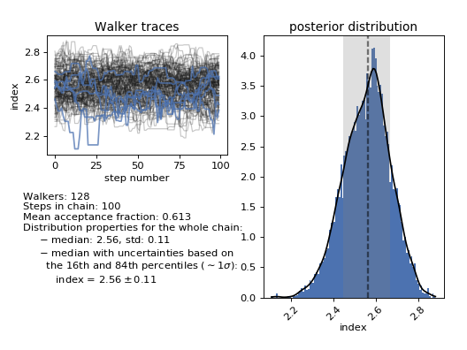
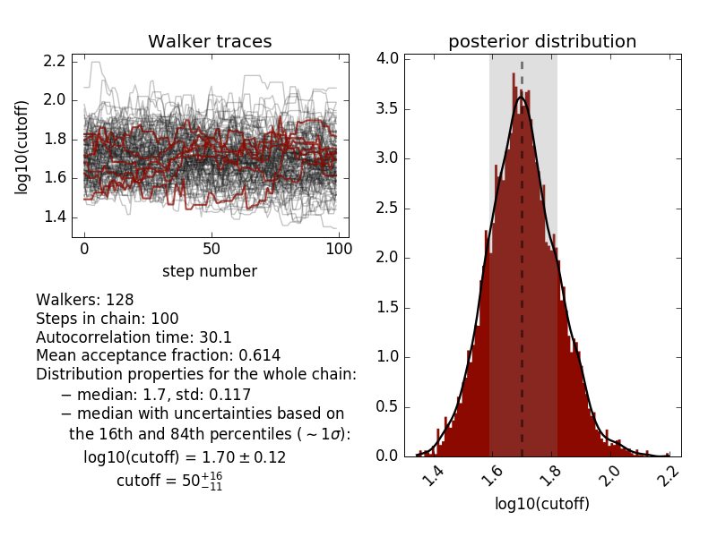
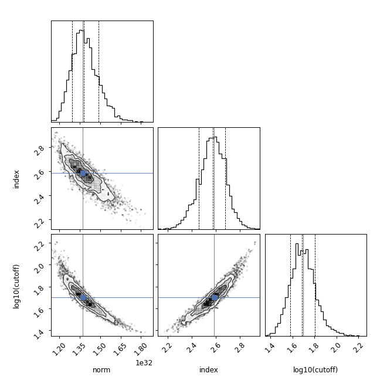
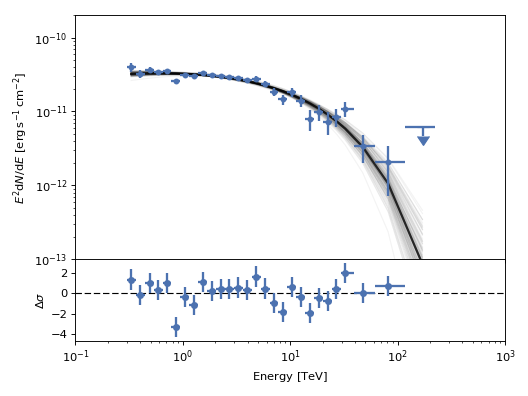
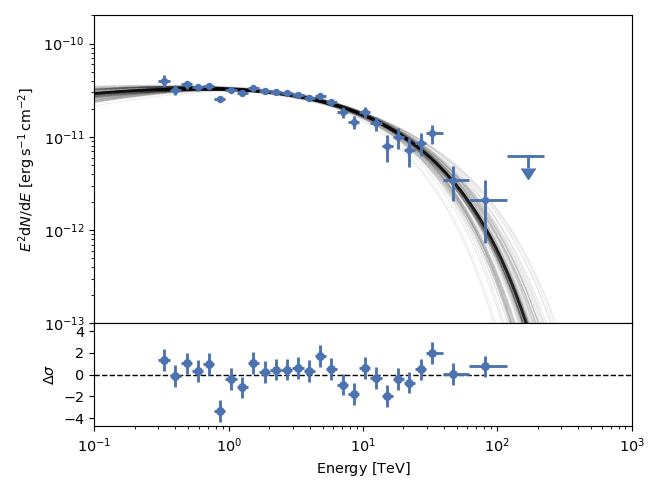
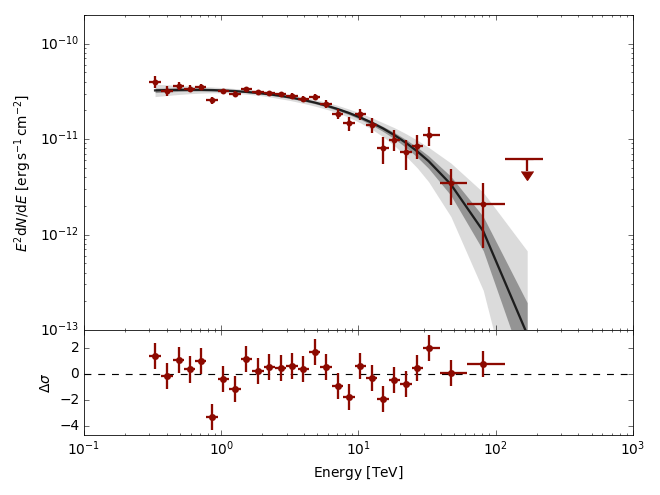
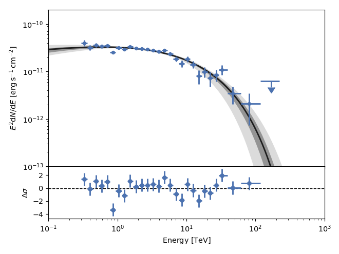
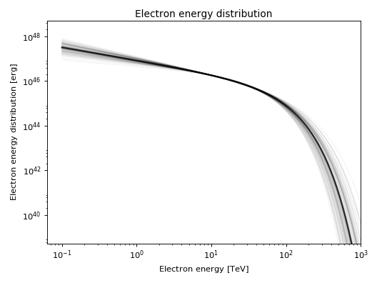
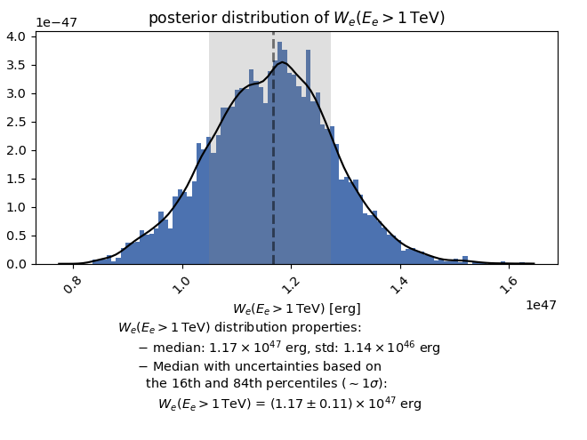

Tutorial
========

The first step in fitting a model to an observed spectrum is to read the
spectrum into the appropriate format. See :ref:`dataformat`  for an explanation
of the format and an example, and :ref:`units`  for a brief explanation of the
unit system used in Naima. We load the spectral data with
`astropy.io.ascii`::

    from astropy.io import ascii
    data = ascii.read('RXJ1713_HESS_2007.dat')

Building the model and prior functions
--------------------------------------

The model function is the function that will be called to compare with the
observed spectrum. It must take two parameters: an array of the free parameters
of the model, and the data table.

Naima includes several models in the `naima.models` module that make it
easier to fit common functional forms for spectra (`~naima.models.PowerLaw`,
`~naima.models.ExponentialCutoffPowerLaw`, `~naima.models.BrokenPowerLaw`, and
`~naima.models.LogParabola`), as well as several radiative models
(`~naima.models.InverseCompton`, `~naima.models.Synchrotron`,
`~naima.models.Bremsstrahlung`, and `~naima.models.PionDecay`; see
:ref:`radiative` for a detailed explanation of these). Once initialized with the
relevant parameters, all model instances can be called with an energy array to
obtain the flux of the model at the values of the energy array. If they are
called with a data table as argument, the energy values from the ``energy``
column will be used.

Building the model function from one of the radiative models is easy. In the
following example, the three model parameters in the ``pars`` array are the
amplitude, the spectral index, and the logarith or the cutoff energy. We first
add the necessary units for the radiative model and then compute and return the
model flux for the energies contained in the data table::

    from naima.models import ExponentialCutoffPowerLaw, InverseCompton
    import astropy.units as u

    def model(pars, data):
        amplitude = pars[0] / u.eV
        alpha = pars[1]
        e_cutoff = (10**pars[2]) * u.TeV

        ECPL = ExponentialCutoffPowerLaw(amplitude, 10*u.TeV, alpha, e_cutoff)
        IC = InverseCompton(ECPL, seed_photon_fields=['CMB',
                            ['FIR', 26.5 * u.K, 0.415 * u.eV / u.cm**3]])

        return IC.flux(data, distance=1.0*u.kpc)

In addition, we must build a function to return the prior function, i.e., a
function that encodes any previous knowledge you have about the parameters, such
as previous measurements or physically acceptable ranges. Two simple priors
functions are included with Naima: `~naima.normal_prior`, and
`~naima.uniform_prior`, and `~naima.loguniform_prior`.  `~naima.uniform_prior`
can be used to set parameter limits. Following the example above, we might want
to limit the amplitude to be positive, and the spectral index to be between -1
and 5::

    from naima import uniform_prior

    def lnprior(pars):
        lnprior = uniform_prior(pars[0], 0., np.inf) \
                + uniform_prior(pars[1], -1, 5)
        return lnprior

Selecting a starting point for the sampling
-------------------------------------------

Before starting the MCMC run, we must provide the procedure with initial
estimates of the parameters and their names::

    p0 = np.array((1e33, 3.0, np.log10(30)))
    labels = ['norm', 'index', 'log10(cutoff)']

This example is relatively simple, but for more complicated models (in
particular those with more than one emission channel, such as Synchrotron and
Inverse Compton) it may be difficult to provide an adequate initial parameter
vector without comparing it visually with the spectra. For these models, an
initial parameter vector far from the maximum likelihood vector may mean that
during the minimization or sampling process the algorithm gets stuck in a local
maximum.

In order to make an adequate estimation easier, Naima provides a tool to
interactively see the output of the model and compare it with the observed data
while changing the parameter values. This tool can be accessed in two ways: the
first is setting `interactive=True` in the options of `~naima.get_sampler` or
`~naima.run_sampler` (see below in `sampling`_ for details on these functions).
This will launch an interactive `matplotlib` window in which the parameters can
be changed and the resulting model compared to the observed spectra. With each
change, the log probability of the model given the observed spectra is computed.
In addition, a Nelder-Mead fit can be launched from a button in the window to
find the maximum likelihood parameter vector. Once you are happy that the
current model is a good approximation to the observed spectrum, closing the
window (whether through the window manager or the `Close window` button) will
use the current parameter vector as a starting point for the sampling procedure.

The alternative way of accessing the interactive fitter is to access it directly
through the class `naima.InteractiveModelFitter` from an interactive Python
interpreter.
The parameter vector shown in the interactive window can be accessed through the
``imf.pars`` attribute, and then copied to a new ``p0`` variable to be used in
the sampling::

    >> imf = InteractiveModelFitter(model, p0, data=data, labels=labels)
    >> # interactive fitting done
    >> p0 = imf.pars
    
Note that the ``data`` argument can be omitted and an energy range specified through the
``e_range`` argument to inspect the behaviour of the model independently of the
data::

    >> imf = InteractiveModelFitter(model, p0, e_range=[1*u.GeV, 100*u.TeV])

.. _sampling:

Sampling the posterior distribution function
--------------------------------------------

All the objects above can then be provided to `~naima.run_sampler`, the main
fitting function in Naima::

    sampler, pos = naima.run_sampler(data_table = data, p0=p0, label=labels,
                    model=model_function, prior=lnprior,
                    nwalkers=128, nburn=50, nrun=10, threads=4)

The ``nwalkers`` parameter specifies how many *walkers* will be used in the
sampling procedure, ``nburn`` specifies how many steps to be run as *burn-in*,
and ``nrun`` specifies how many steps to run after the *burn-in* and save these
samples in the sampler object. For details on these parameters, see the
`documentation of the emcee package <http://dan.iel.fm/emcee/current/>`_.

.. _plotting:

Inspecting and analysing results of the run
-------------------------------------------

The results stored in the sampler object can be analysed through the plotting
procedures of Naima: `~naima.plot_chain`, `~naima.plot_fit`, and
`~naima.plot_data`. In addition, two convenience functions can be used to
generate a collection of plots that illustrate the results and the stability of
the fitting procedure. These are `~naima.save_diagnostic_plots`::

    naima.save_diagnostic_plots('RXJ1713_IC', sampler,
                                blob_labels=['Spectrum', 
                                             'Electron energy distribution',
                                             '$W_e (E_e>1$ TeV)'])

and `~naima.save_results_table`::

    naima.save_results_table('RXJ1713_naima_fit', sampler)

The saved table will include information in the metadata about the run such as
the number of walkers ``n_walkers`` and steps ``n_run`` sampled, the initial
parameter vectori ``p0``, the parameter vector with the maximum likelihood
``ML_pars`` and the maximum value of the negative log-likelihood
``MaxLogLikelihood``. The table itself shows the median and upper and lower
uncertainties (50th, 84th, and 16th percentiles of the posterior distribution)
for the parameters sampled: 

.. literalinclude:: _static/RXJ1713_IC_results_table.txt

The table is saved by default in `ECSV format
<https://github.com/astropy/astropy-APEs/blob/master/APE6.rst>`_ which can be
easily accesed with the `astropy.io.ascii` module.

Plotting functions: chains
++++++++++++++++++++++++++

The function `~naima.plot_chain` will show information about the MCMC chain for
a given parameter. It shows the parameter value with respect to the step number
of the chain, which can be used to assess the stability of the chain, a plot of
the posterior distribution, and several statistics of the posterior
distribution. One of these is the median and 16th and 84th percentiles of the
distribution, which can be reported as the inferred marginalised value of the
parameter and associated :math:`1\sigma` uncertainty. For the electron index
(parameter 1), `~naima.plot_chain` shows:

For parameters that have been sampled in logarithmic space  and their parameter
label includes ``log10`` or ``log``, `~naima.plot_chain` will also compute the
value and percentiles in linear space:

The relationship between the samples of the different parameters can be seen
though a `corner plot <https://github.com/dfm/corner.py>`_ with
`~naima.plot_corner` which is a wrapper around `corner.corner`. The maximum
likelihood parameter vector can be indicated with cross:

Plotting functions: fit
+++++++++++++++++++++++

The plot function `~naima.plot_fit` allows for several ways to represent the
results of the MCMC fitting. By default, it will show the Maximum Likelihood
model with a black line, and 100 samples from the posterior distribution in
gray:

The 100 samples are taken from the blobs stored in the sampler, so they only
contain the model values at the observed flux points. If you want to show the
samples and ML model for a wider energy range (or between energy bands like
X-ray and gamma-ray) you can use the ``e_range`` parameter. Note that the model
will be recomputed ``n_samples`` times (by default 100) when ``plot_fit`` is
called, so this may significantly slow the plot speed if the model function
calls are expensive. Setting ``e_range=[100*u.GeV, 100*u.TeV]``, we obtain the
following plot:

The spread of the parameters in the posterior distribution can also be
visualized as confidence bands. Using the ``confs`` parameter of ``plot_fit``, a
confidence band will be computed for each of the confidence levels (in sigma)
given in ``confs``. Setting ``confs=[3,1]``, the confidence bands at
:math:`1\sigma` and :math:`3\sigma` are plotted. Note that no samples are shown
if the ``confs`` parameter is set:

As for the plot showing the samples, the energy range for the confidence bands
can be set through the ``e_range`` parameter. The number of samples needed will
be computed so that the highest confidence level given can be constrained. This
results in 740 samples for a :math:`3\sigma` confidence level:

.. _saving:

Saving and retrieving the results of the sampling run
-----------------------------------------------------

The parameter chain and metadata blobs resulting from the sampling procedure can
be saved with `naima.save_run`. This function will save the results of the run
to an HDF5 file that can be archived and analysed after the fact. The sampler
properties saved to the HDF5 file are:

- parameter vector chain: ``sampler.chain``
- log-probability for all the parameter vectors in the chain:
  ``sampler.lnprobability``
- parameter labels: ``sampler.labels``
- data table: ``sampler.data``
- metadata blobs: ``sampler.blobs``

Note that only metadata blobs that can be converted into a numpy array will be
stored. Blobs consisting of other classes, or with different lengths within the
same blob, will raise a warning and be discarded on the `naima.save_run` call.

The saved sampler can be retrieved with the `naima.read_run` function, which
will return an `~emcee.EnsembleSampler`-like object. However, the model function
cannot be saved in the HDF5 file, so a model function has to be provided at read
time. This function will be used to compute the model output from the parameter
vectors in the chain. Without a model function, the sampler read from the HDF5
file can be passed onto `~naima.plot_chain`, `~naima.plot_corner`,
`~naima.plot_fit`, and `~naima.plot_data` for analysis.  If a model function is
provided to `naima.read_run`, the resulting sampler can also be used with
`~naima.plot_fit` when setting the ``e_range`` parameter, which requires the
model function to be accesible in the ``modelfn`` attribute of the sampler
object provided.

.. _blobs:

Saving additional information --- Metadata blobs
------------------------------------------------

If we wish to save additional information at each of the model computations,
extra information can be returned from the model call. This extra information
(known as metadata blobs; see details in the `emcee documentation
<http://dan.iel.fm/emcee/current/user/advanced/#arbitrary-metadata-blobs>`_) is
stored in the sampler object returned from the fitting and can be accessed
later. There are three formats for the data stored as a metadata blob that will
be understood by the plotting routines of Naima:

- A `~astropy.units.Quantity` scalar. A histogram and distribution properties
  (median, 16th and 84th percentiles, etc.) will be plotted.
- A `~astropy.units.Quantity` array with the same length as the observed
  spectrum energy array. If it has a physical type of flux or luminosity, it
  will be interpreted as a photon spectrum and plotted against the observed
  spectrum energy array.
- A pair (tuple or list) of `~astropy.units.Quantity` arrays of equal length.
  They will be plotted against each other.

When fitting a radiative output to a spectrum, information on the particle
distribution (e.g., the actual particle distribution, or the total energy in
relativistic particles) can be saved as a metadata blob.  Below is an example
that does precisely this with an Inverse Compton emission model::

    from naima.models import ExponentialCutoffPowerLaw, InverseCompton
    import astropy.units as u
    import numpy as np

    def model_function(pars, data):
        amplitude = pars[0] * (1 / u.eV)
        alpha = pars[1]
        e_cutoff = (10**pars[2]) * u.TeV
        e_0 = 10 * u.TeV

        ECPL = ExponentialCutoffPowerLaw(amplitude, e_0, alpha, e_cutoff)
        IC = InverseCompton(ECPL, seed_photon_fields=['CMB',
                            ['FIR', 26.5 * u.K, 0.415 * u.eV / u.cm**3]])

        # The total enegy in electrons of model IC can be accessed through the
        # attribute We or obtained for a given range with compute_We
        We = IC.compute_We(Eemin = 1*u.TeV)

        # We can also save the particle distribution between 100 MeV and 100 TeV
        electron_e = np.logspace(11, 15, 100) * u.eV
        electron_dist = ECPL(electron_e)

        # The first object returned must be the model photon spectrum, and
        # subsequent objects will be stored as metadata blobs
        return IC(data), (electron_e, electron_dist), We

The additional quantities we have stored can the be accesed in the
`sampler.blobs` list. The function `~naima.plot_blob` allows to plot them and
extract distribution properties. For the blobs that are a tuple or have the same
length as ``data['energy']``, they will be plotted as spectra:

and for the ones that are a scalar value, such as the total energy in electrons that
we returned as the third object, a histogram and distribution properties will be
plotted:

